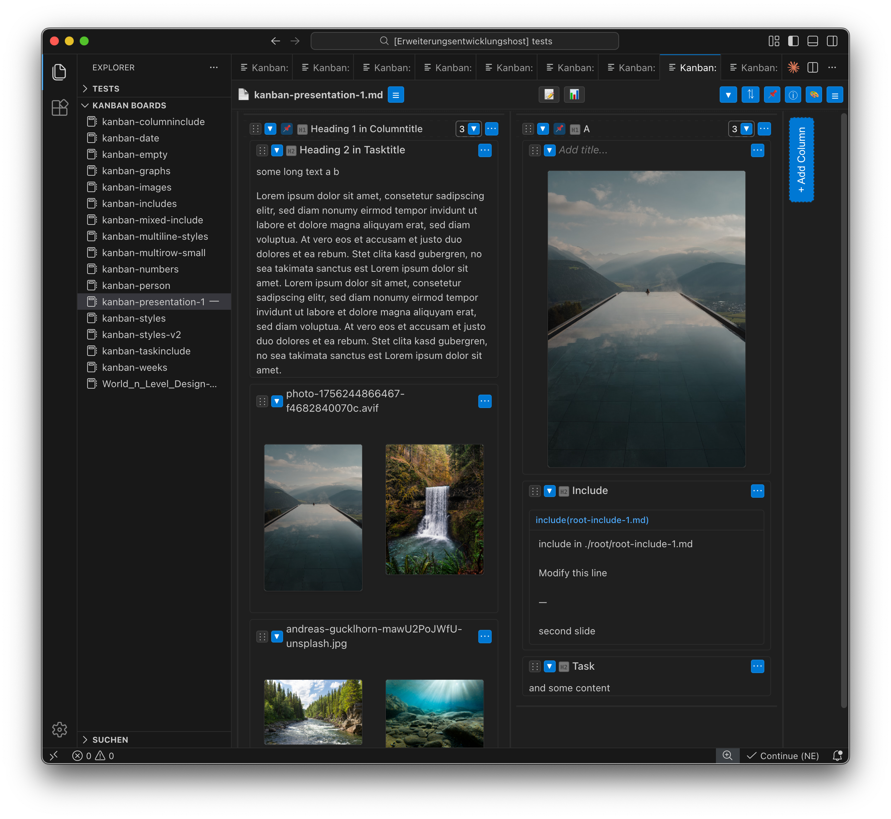

# Ludos Kanban Editor

---

## Description

This is a feature packed kanban editor that runs as an visual studio code editor extension.

I started this project to create and maintain lecture presentations for my university lectures. As i have been using marp (markdown based presentation tool) several years, and my structure and plugins got more and more complex i wanted to simplify my work environment. I have been using vscode because it's an versatile editor, has lots of plugins, integrates visual editors and allows moving, renaming files within the workspaces. I have started to create and manage new lectures and i found no good tool to create an extensive research storage with a good overview that is local first and doesnt need any subscription (i would never use a subscription based tool that can lock in my data).

This markdown editor contains to many features. 
- Foremost it's managing columns and tasks. 
- But you can organize columns as you want into stacks, into multiple rows. 
- You can fold them, you can make theyr headers sticky (so you can move content into them even outside the view.) . 
- It has an extensive layout system to customize the viewport with some reasonable defaults. 
- It has drag & drop features (from desktop with copy, from clipboard to create files from binary data or direct links from vscode, from clipboard or column templates). 
- It can embed images (regular image formats, but also excalidraw, drawio, mermaid, plantuml and pdf), videos (mp4, only some audio formats), other markdown files and links. 
- It can export with marp to create live-presentations, pdf-handouts and also editable pptx (an alpha feature of marp), presentations can in realtime update on kanban board modifications. 
- It can also pack all or parts of the kanban into data into a single folder including media.
- It has a extensive Tag system with labels, colors, person and automatic sorting features.

---

## Installation

To use it, install the vsix into the visual studio code editor in the extensions by using the breadcrumbs / burger menu on the top right and select "install from vsix". 

You can use the editor without any of the external dependencies, but some features will not work.

For additional features you will need to install other addons as well:
- marp
- excalidraw
- drawio
- pdf
- mermaid
- plantuml

(detailed explanation still missing, some require vscode extensions, some require a command line tool to convert)

---

### Presentation mode

to create the presentations you will need the marp-engine folder from the sourcecode and install marp <https://github.com/marp-team/marp-cli>

define the paths to these files in the config settings:

- markdown-kanban.marp.enginePath
  - /Users/username/marp-engine/engine.js
  - c:/users/username/marp-engine/engine.js
- markdown-kanban.marp.themeFolders
  - /Users/username/marp-engine/themes
  - c:/users/username/marp-engine/themes
- markdown-kanban.marp.defaultTheme
  - default

---

### Installation of addons

OSX: 
  on osx a lot of command line tools can be installed using brew <https://brew.sh/>
  i am only giving instructions on how to do it using brew

Windows:
  download the applications from the download and install.
  i use foremost apple, but i am trying to fix problems i know of under windows

### Excalidraw

install the excalidraw addon from vscode addons

### Drawio

Windows: download from <https://github.com/jgraph/drawio-desktop/releases>

OSX: brew install --cask drawio
or Download the CLI-capable version from:
  https://github.com/jgraph/drawio-desktop/releases

define the setting:
- markdown-kanban.drawioPath

### PDF

OSX: brew install poppler

Windows: https://github.com/oschwartz10612/poppler-windows/releases/tag/v25.12.0-0

define the path of poppler in the setting:
- markdown-kanban.popplerPath

### Plantuml

is implemented, installations instructions todo

### Mermaid

is implemented, installations instructions todo

### Java

is implemented, installations instructions todo, required for mermaid i think

---

## Markdown features

\-\-\-\:
Column 1
\:\-\-\:
Column 2
\:\-\-\-

\;; comment 

\[comment\]\(/path/to/file "label"\)
\[comment\]\(/path/to/file "label"\)
\[\[markdown-file-link\]\]
\<https://url.link.com\>

comment\[^com\]

\[^com\]: some explanation

comment^\[comment\]

\> indented note

\!\[\]\(\) view images (drawio, excalidraw, jpg etc) and videos

\`\`\`mermaid
\`\`\`

\`\`\`plantuml
\`\`\`

\- one (normal dotted list)
\* two (normal dotted list, incremental dispaly in slide)
\+ tree (no dot, incremental display in slide)

\=\=highlight\=\=

\^\^sup\^\^ \_\_sub\_\_ \~\~striketrough\~\~
\*as well\* \*\*as the normal styles\*\*

---

## Tag features

The Kanban board uses a flexible tag system with four distinct tag types, each with its own prefix character. Tags capture everything after the prefix until whitespace (space, tab, or newline).

| Prefix | Type | Description | Examples |
|--------|------|-------------|----------|
| # | Hash tags | Regular tags for categorization | #todo , #urgent , #feature |
| @ | Person tags | Assign people/mentions | @john , @team-alpha |
| ! | Temporal tags | Dates, times, weeks, weekdays | !2025.01.28 , !w15 , !mon |
| ? | Query tags | Gather cards matching criteria by putting it into a column header | ?#todo , ?@reto , ?!today |

---

### Reserved Tags

some tags are used to save some of the special settings of the kanban such as:

| Tag | Description | Example |
|-----|-------------|---------|
| \#row2 | Place column in row 2 | ## Backlog \#row2 |
| \#span2 | Column spans 2 units wide | ## Main \#span2 |
| \#stack | Stack columns horizontally | ## Week 1 \#stack |
| \#stick | Prevent card from being moved during sorting |

---

## Temporal Tags (`!`)

Date and time tags for scheduling. The `!` prefix is followed by various time formats.

- Date Formats
  - !2025.01.28      # Date with dots
  - !2025-01-28      # Date with dashes
  - !2025/01/28      # Date with slashes
- Week Tags
  - !w15             # Week 15 (current year)
  - !W15             # Case insensitive
  - !2025.w15        # Week 15 of 2025
  - !2025-w15        # Alternative format
- Weekday Tags
  - !mon !monday     # Monday
  - !tue !tuesday    # Tuesday
  - !wed !wednesday  # Wednesday
  - !thu !thursday   # Thursday
  - !fri !friday     # Friday
  - !sat !saturday   # Saturday
  - !sun !sunday     # Sunday
- Time Tags
  - !15:30           # 24-hour format
  - !9am             # 12-hour format
  - !10pm            # Evening
  - !22:00           # 24-hour evening
- Time Slot Tags
  - !9am-5pm         # Work hours
  - !15:30-17:00     # Meeting slot
  - !10am-12pm       # Morning block

### Temporal Highlighting

Cards and columns with temporal tags matching the current date/time are automatically highlighted (e.g., today's date, current week, current weekday).

---

## Query Tags (`?`)

Query tags gather/collect cards matching specific criteria into a column. The `?` is followed by a tag type prefix (`#`, `@`, or `.`) and the query content.

### Basic Syntax

```markdown
Reto's Tasks ?@reto
Todo Items ?#todo
Today ?.today
```

### Query Operators

| Operator | Description | Example |
|----------|-------------|---------|
| `&` | AND - all conditions must match | `?#urgent&important` |
| `\|` | OR - any condition matches | `?@reto\|bruno` |
| `!` | NOT - exclude matches | `?#todo!done` |

### Query Examples

- Gather by Person

  - Reto's Tasks ?@reto
  - Team Work ?@reto|bruno|anna

- Gather by Hash Tag

  - Urgent ?#urgent
  - Features ?#feature&frontend
  - Not Done ?#todo!completed

- Gather by Temporal

  - Today ?.today
  - Today (alternate) ?.day=0
  - This Week ?.w15
  - Monday Tasks ?.mon

- Gather by Day Offset

  * Use comparison operators with `day` to gather cards relative to today. The `day` property represents the number of days from today (negative = past, positive = future).

  - Past Due ?.day<0
  - Today ?.day=0
  - Tomorrow ?.day=1
  - Next 7 Days ?.day<7
  - Next 3 Days ?.day>0&day<4
  - Past Week ?.day>-7&day<0

| Expression | Description |
|------------|-------------|
| ?.day<0 | Cards with dates before today (overdue) |
| ?.day=0 | Cards with today's date |
| ?.day>0 | Cards with future dates |
| ?.day=1 | Cards with tomorrow's date |
| ?.day<7 | Cards within the next 7 days (including today) |
| ?.day>0&day<4 | Cards 1-3 days from now (tomorrow to 3 days out) |
| ?.day>-7&day<0 | Cards from the past 7 days (not including today) |
| ?.day>-7&day<7 | Cards within ±7 days of today |

#### Combined Queries

A column can have multiple query tags:

- Reto This Week ?@reto ?.w15

### Operators

| Operator | Description | Example |
|----------|-------------|---------|
| & | AND | \#gather_Reto&day<3 |
| \| | OR | \#gather_Reto\|Anita |
| = | EQUAL | \#gather_day=0 |
| != | NOT EQUAL | \#gather_weekday!=sat |
| < | LESS THAN | \#gather_day<7 |
| > | GREATER THAN | \#gather_day>0 |

### Date Properties

| Property | Description | Values |
|----------|-------------|--------|
| day | Days from today | -2, -1, 0, 1, 2, ... |
| weekday | Day name | mon, tue, wed, ... |
| weekdaynum | Day number | 1 (Mon) to 7 (Sun) |
| month | Month name | jan, feb, mar, ... |
| monthnum | Month number | 1 to 12 |

### ?ungathered

Collects all cards that didn't match any gather rule:

---

## Keyboard Shortcuts:

- paste cmd+shift+v ctrl+shift+v to paste content with link detection
- drag & drop with shift to embed in the kanban
  - will detect files and < 10mb copy to a {filename}-Media folder

I recommend setting up some keyboard shortcuts in vscode for the following structures:
- \-\-\-\:  \:\-\-\: \:\-\-\-
- \!\[\]\(\)

---

## Screenshot




---
