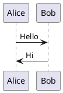
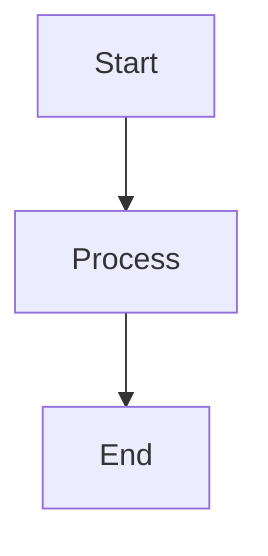

# Markdown Kanban - Complete User Guide

**Version:** 0.27.47
**Last Updated:** 2025-11-04

---

## Table of Contents

1. [Getting Started](#getting-started)
2. [Basic Board Operations](#basic-board-operations)
3. [Column Management](#column-management)
4. [Task/Card Operations](#task-card-operations)
5. [Tag System & Auto-Sorting](#tag-system--auto-sorting)
6. [Include Files System](#include-files-system)
7. [Links & Media](#links--media)
8. [Search & Navigation](#search--navigation)
9. [Export & Presentations](#export--presentations)
10. [Visual Customization](#visual-customization)
11. [Keyboard Shortcuts](#keyboard-shortcuts)
12. [Settings Reference](#settings-reference)

---

## Getting Started

### What is Markdown Kanban?

Markdown Kanban is a VS Code extension that transforms markdown files into interactive Kanban boards. Your board is stored as plain markdown, making it version-control friendly and portable.

### Creating Your First Board

1. **Create a markdown file** with the required YAML header:

```markdown
---
kanban-plugin: board
---

## To Do

- [ ] First task
- [ ] Second task

## In Progress

- [ ] Active task

## Done

- [x] Completed task
```

2. **Open the board**:
   - Click the "Kanban" button in the editor toolbar, OR
   - Run command: `Markdown Kanban: Open Kanban Board`

3. **Start working!** Your board is now interactive.

### File Requirements

- **YAML Header**: Must contain `kanban-plugin: board`
- **Columns**: H2 headings (`## Column Name`)
- **Tasks**: Markdown checklist items (`- [ ] Task` or `- [x] Task`)

---

## Basic Board Operations

### Opening & Closing Boards

**Open Board:**
- Click "Kanban" button in editor toolbar
- Command: `Markdown Kanban: Open Kanban Board`

**Auto-switching:**
- Toggle automatic board switching when changing files
- Access: File bar menu → Toggle auto-switching

**Lock/Unlock File:**
- Lock board to prevent automatic switching
- Access: File bar menu → Toggle file lock

### Save Operations

**Save Board** (`Ctrl+S` / `Cmd+S`):
- Saves all changes to the markdown file
- Auto-saves when you save in VS Code

**Unsaved Changes:**
- Yellow indicator appears when board has unsaved changes
- Close protection: Warns before closing with unsaved changes

**Undo/Redo:**
- **Undo**: `Ctrl+Z` / `Cmd+Z`
- **Redo**: `Ctrl+Y` / `Cmd+Shift+Z`
- Full history of all board modifications

### Board Initialization

If your markdown file lacks the required YAML header:
1. An "Initialize Board" button will appear
2. Click to add the required header
3. Board will activate automatically

---

## Column Management

### Adding & Removing Columns

**Add Column:**
- Click "+ Add Column" button at the end of each row
- Column appears at the end of the current row

**Delete Column:**
- Click column menu (⋯) → "Delete column"
- Deletes column and all its tasks

**Insert Column:**
- Column menu → "Insert column before/after"
- Adds column at specific position

### Organizing Columns

**Move Column:**
- **Drag & Drop**: Drag column to new position
- **Menu Options**: Column menu → "Move column left/right"

**Column Width (Span):**
- Column menu → Width controls (− / +)
- Allows columns to span multiple columns
- Useful for emphasizing important columns

**Multi-Row Layout:**
- Assign columns to specific rows using `#row{number}` tag
- Example: `## Column #row2` assigns to row 2
- Configure: Settings → `layoutRows`

### Column Display Modes

**Stack Mode:**
- Toggle: Column menu → Stack icon button
- Tag: Add `#stack` to column title
- Stacks tasks vertically in a compact format

**Fold/Unfold:**
- **Column Folding**: Click column header to collapse
- **Fold All Tasks**: Fold-all button (▶/▼/▽) in column header
- **Global Fold/Unfold**: Board header → Fold-all button

### Column Sorting

**Sort by Date:**
- Add `#sort-bydate` tag to column title
- Sorts tasks by date tags (@due:, @start:, etc.)
- Sticky tasks (@sticky) remain at top

**Sort by Name:**
- Add `#sort-byname` tag to column title
- Alphabetical sorting of task titles

### Column Export

**Export Column:**
- Column menu → "Export column"
- Exports column content to file
- Supports multiple formats

**Copy as Markdown:**
- Column menu → "Copy as markdown"
- Copies column to clipboard in markdown format

---

## Task/Card Operations

### Creating & Editing Tasks

**Add Task:**
- Click "+ Add Card" button in column
- Click "Add task" button when column is empty

**Edit Task Title:**
- Click on task title
- Type to edit
- Press Enter or click outside to save

**Edit Task Description:**
- Click in task content area
- Full markdown editor with live preview
- Supports images, links, lists, and more

**Task Checkbox:**
- Click checkbox to mark complete/incomplete
- Syncs with markdown (`- [ ]` ↔ `- [x]`)

### Moving Tasks

**Drag & Drop:**
- Drag task to different column
- Drag within column to reorder

**Context Menu Options:**
- **Insert card before/after**: Add task at specific position
- **Move task up/down**: Reorder within column
- **Move to top/bottom**: Jump to first/last position
- **Move to column**: Choose destination column

### Task Actions

**Duplicate Task:**
- Task menu (⋯) → "Duplicate card"
- Creates exact copy in same column

**Delete Task:**
- Task menu → "Delete card"
- Removes task permanently

**Copy as Markdown:**
- Task menu → "Copy as markdown"
- Copies task to clipboard

**Fold/Unfold Task:**
- Click fold toggle (▶) on task
- Collapses/expands task content

---

## Tag System & Auto-Sorting

### Person Tags (@tags)

Assign people to tasks using `@` tags:

```markdown
- [ ] Review design @Reto @Anita
```

**Features:**
- Multiple people per task
- Works in title or description
- Used for gather rules and filtering

### Date Tags

**Shorthand Format:**
```markdown
- [ ] Complete by @2025-03-27
- [ ] Due @27-03-2025
```

**Typed Format:**
```markdown
- [ ] @due:2025-03-27
- [ ] @done:2025-03-26
- [ ] @start:2025-03-20
- [ ] @end:2025-03-30
- [ ] @modified:2025-03-25
```

**Supported Date Types:**
- `@due:` - Due date
- `@done:` - Completion date
- `@start:` - Start date
- `@end:` - End date
- `@modified:` - Last modified date

### Sticky Tag

Prevent tasks from moving during auto-sorting:

```markdown
## Important #gather_@sticky

- [ ] Critical task @sticky
```

**Sticky tasks:**
- Always stay at the top
- Not affected by gather rules or sorting
- Useful for pinned/priority items

### Gather Rules (#gather_)

Automatically collect cards matching criteria into columns:

**Basic Gather:**
```markdown
## Reto's Tasks #gather_@Reto
## This Week #gather_@due:day<7
## Overdue #gather_@due:day<0
```

**Operators:**
- `=` Equal
- `!=` Not equal
- `<` Less than
- `>` Greater than
- `&` AND (all conditions must match)
- `|` OR (any condition matches)
- `!` NOT (negation)

**Complex Examples:**
```markdown
## Urgent Frontend #gather_@priority=urgent&@category=frontend
## Reto or Anita #gather_@Reto|@Anita
## Not Backend #gather_!@category=backend
```

### Date Properties for Gather

Use date properties in gather rules:

**Day Properties:**
- `day` - Days from today
- `dayoffset` - Days from today (same as day)
- `weekday` - Day name (mon, tue, wed, thu, fri, sat, sun)
- `weekdaynum` - Day number (1=Monday, 7=Sunday)

**Month Properties:**
- `month` - Month name (jan, feb, mar, etc.)
- `monthnum` - Month number (1-12)

**Examples:**
```markdown
## This Monday #gather_@due:weekday=mon&@due:day<7
## March Tasks #gather_@due:month=mar
## Next 7 Days #gather_@due:day<7
```

### Ungathered Column

Collect all cards not matched by other gather rules:

```markdown
## Ungathered #ungathered
```

**Features:**
- Always processed last
- Catches unmatched cards
- Useful for inbox/backlog

### Performing Sort

1. Configure gather rules in column titles
2. Click "Sort" button in board toolbar
3. Cards automatically move to matching columns
4. Sticky cards remain at top

---

## Include Files System

### What are Includes?

Include files let you reference external markdown files within your board. Changes to included files automatically update in the board.

### Include Syntax

**Inline Include:**
```markdown
!!!include(path/to/file.md)!!!
```

**Relative Paths:**
```markdown
!!!include(../tasks/team-tasks.md)!!!
```

**Column Include:**
Use column context menu to link entire column to external file.

### Column Include Mode

**Enable Include:**
1. Column menu (⋯) → "Enable include mode"
2. Select file to link
3. Column content now comes from external file

**Edit Include File:**
- Column menu → "Edit include file"
- Opens linked file in editor

**Disable Include:**
- Column menu → "Disable include mode"
- Converts back to inline content

### Task Include Mode

**Enable Include:**
1. Task menu (⋯) → "Enable include mode"
2. Select file to link
3. Task content now comes from external file

**Edit Include File:**
- Task menu → "Edit include file"
- Opens linked file in editor

**Disable Include:**
- Task menu → "Disable include mode"
- Converts back to inline content

### Include Management

**Open Include File:**
- Click on include reference
- Opens file in editor

**Reload Includes:**
- Refreshes all include files
- Useful after external file changes

**Save Include:**
- Save individual include files
- Changes propagate to board

---

## Links & Media

### File Links

**Link to Files:**
```markdown
[Open file](path/to/file.md)
```

**Click Behavior:**
- **Click**: Opens in current editor
- **Alt+Click**: Opens in new tab (configurable)

**Path Types:**
- Relative: `../tasks/file.md`
- Absolute: `/Users/name/file.md`
- Configure: Settings → `pathGeneration`

### Wiki Links (Obsidian Style)

```markdown
[[filename]]
[[filename#heading]]
[[filename|Display Text]]
```

**Features:**
- Compatible with Obsidian
- Opens in VS Code editor
- Supports heading links

### External Links

```markdown
[Google](https://www.google.com)
```

Opens in default browser.

### Images

**Embed Images:**
```markdown

```

**Supported Formats:**
- PNG, JPG, GIF, SVG
- Relative and absolute paths

**Image Actions:**
- **Click**: View larger preview
- **Alt+Click**: Open file location

**Drag & Drop:**
- Drag image from file system
- Creates task with embedded image
- Image is copied to project

**Paste from Clipboard:**
- Paste image with `Ctrl+V` / `Cmd+V`
- Creates file and inserts link
- Configurable save location

### Path Management

**Copy Resolved Path:**
- Right-click link → "Resolve and copy path"
- Copies full file system path

**Path Generation:**
- Configure: Settings → `pathGeneration`
- Options: Relative, Absolute

---

## Search & Navigation

### Global Search

**Open Search** (`Ctrl+F` / `Cmd+F`):
- Searches across all cards and columns
- Live highlighting of results
- Navigate with Next/Previous buttons

**Search Options:**
- **Case Sensitive**: Toggle button
- **Whole Word**: Match complete words
- **Regex**: Use regular expressions

**Search Scope:**
- Card titles
- Card descriptions
- Column titles

**Navigation:**
- **Next Result**: Down arrow or Next button
- **Previous Result**: Up arrow or Previous button
- **Close**: Escape key

### Keyboard Navigation

**Arrow Key Navigation:**
- Move focus between cards
- Configurable scroll behavior

**Settings:**
- `arrowKeyFocusScroll`: center / nearest
  - **center**: Scrolls card to center of view
  - **nearest**: Minimal scrolling

---

## Export & Presentations

### Export Board

**Access Export:**
- File bar menu → Export, OR
- Export button in toolbar

**Export Formats:**
1. **Kanban Markdown** - Standard kanban format
2. **Presentation Markdown** - Formatted for presentations
3. **Marp Markdown** - Marp presentation format
4. **Marp HTML** - HTML presentation
5. **Marp PDF** - PDF presentation
6. **Marp PPTX** - PowerPoint presentation
7. **Custom** - User-defined formats

**Export Scopes:**
- Full Board
- Single Row
- Single Stack
- Single Column
- Single Task

### Marp Integration

**What is Marp?**
Marp is a markdown presentation ecosystem. This extension provides full integration.

**Preview Presentation:**
1. Export to Marp format
2. Opens in Marp preview mode
3. Real-time updates as you edit

**Marp Themes:**
- Store themes in configured folders
- Default locations: `.marp/themes/`, `themes/`, `_themes/`, `assets/themes/`
- Configure: Settings → `marp.themeFolders`

**Export to Multiple Formats:**
- Markdown → HTML → PDF → PPTX
- One-click conversion
- Preserves formatting and styles

### Auto-Export

**Enable Auto-Export:**
1. Configure export settings
2. Enable auto-export on save
3. Board exports automatically when saved

**Stop Auto-Export:**
- Disable in export settings
- Or manually stop from menu

### Diagrams

**PlantUML Support:**
````markdown

````

**Convert to SVG:**
- Button appears on diagram
- Converts and embeds as SVG

**Mermaid Support:**
````markdown

````

**Convert to SVG:**
- Button appears on diagram
- Converts and embeds as SVG

---

## Visual Customization

### Layout Configuration

**Column Width:**
- Small: 250px
- Medium: 350px (default)
- Wide: 450px
- 66%: Half screen
- 100%: Full screen

**Setting:** `markdown-kanban.columnWidth`

**Layout Rows:**
- Options: 1-6 rows
- Columns distributed across rows
- Setting: `markdown-kanban.layoutRows`

**Row Height:**
- Options: 95vh, 63vh, 48vh, 31.5vh, 44em, 31em, 19em, auto
- Setting: `markdown-kanban.rowHeight`

**Max Row Height:**
- Limit row height in pixels
- 0 = unlimited
- Setting: `markdown-kanban.maxRowHeight`

### Card Appearance

**Task Minimum Height:**
- Options: auto, 200px, 400px, 43.5vh, 89vh
- Setting: `markdown-kanban.taskMinHeight`

**Section Heights:**
- Control individual section heights
- Settings: `sectionHeight`, `taskSectionHeight`

### Typography

**Font Size:**
- Options: small, normal, bigger, large, xlarge
- Setting: `markdown-kanban.fontSize`

**Font Family:**
- Options: system, roboto, opensans, lato, poppins, inter, helvetica, arial, georgia, times, firacode, jetbrains, sourcecodepro, consolas
- Setting: `markdown-kanban.fontFamily`

### Spacing

**Whitespace Padding:**
- CSS size value (e.g., "4px", "0.5em")
- Default: 4px
- Setting: `markdown-kanban.whitespace`

### Tag Colors

**Custom Tag Colors:**
Configure colors for different tag categories:

```json
{
  "markdown-kanban.tagColors": {
    "importance": {
      "critical": {
        "light": "#ff0000",
        "dark": "#ff6b6b",
        "border": true,
        "headerBar": true
      }
    }
  }
}
```

**Tag Categories:**
- default
- importance (critical, urgent, priority)
- status (blocked, review, testing, wip)
- priority (urgent, high, normal, low)
- status2 (delayed, stopped)
- category (backend, frontend, database)

**Color Options:**
- `light`: Color for light theme
- `dark`: Color for dark theme
- `border`: Show colored border
- `headerBar`: Show colored header bar
- `cornerBadge`: Show corner badge

### Tag Visibility

**Control Tag Display:**
- Options: all, standard, custom, mentions, none
- Setting: `markdown-kanban.tagVisibility`

### Sticky Positioning

**Sticky Stack Mode:**
- full: Full card sticky in stack
- titleonly: Only title sticky
- none: No sticky behavior
- Setting: `markdown-kanban.stickyStackMode`

### Layout Presets

**Create Presets:**
Save entire layout configurations:

```json
{
  "markdown-kanban.layoutPresets": {
    "compact": {
      "columnWidth": "250px",
      "fontSize": "small",
      "whitespace": "2px"
    },
    "presentation": {
      "columnWidth": "450px",
      "fontSize": "large",
      "layoutRows": 1
    }
  }
}
```

**Apply Preset:**
- Setting: `markdown-kanban.layoutPreset`
- Value: preset name (e.g., "compact")

### Rendering Options

**HTML Comment Rendering:**
- hidden: Hide HTML comments
- text: Show as text
- Setting: `markdown-kanban.htmlCommentRenderMode`

**HTML Content Rendering:**
- html: Render HTML tags
- text: Show HTML as text
- Setting: `markdown-kanban.htmlContentRenderMode`

---

## Keyboard Shortcuts

### Global Shortcuts

| Shortcut | Action |
|----------|--------|
| `Ctrl+F` / `Cmd+F` | Open search panel |
| `Ctrl+Z` / `Cmd+Z` | Undo |
| `Ctrl+Y` / `Cmd+Shift+Z` | Redo |
| `Ctrl+S` / `Cmd+S` | Save board |
| `Ctrl+W` / `Cmd+W` | Close (with unsaved check) |
| `Ctrl+C` / `Cmd+C` | Copy (updates clipboard) |
| `Escape` | Close modals/search |

### Link Shortcuts

| Shortcut | Action |
|----------|--------|
| `Click` | Open link/file |
| `Alt+Click` | Open in new location |

### Search Shortcuts

When search panel is open:

| Shortcut | Action |
|----------|--------|
| `Arrow Up` | Previous result |
| `Arrow Down` | Next result |
| `Escape` | Close search |

### Card Navigation

| Shortcut | Action |
|----------|--------|
| `Arrow keys` | Navigate between cards |

---

## Settings Reference

### Core Settings

| Setting | Default | Description |
|---------|---------|-------------|
| `pathGeneration` | "relative" | Link path format (relative/absolute) |
| `openLinksInNewTab` | false | Open links in new editor tab |
| `columnWidth` | "350px" | Default column width |
| `taskMinHeight` | "auto" | Minimum card height |
| `sectionHeight` | "auto" | Section height |
| `taskSectionHeight` | "auto" | Task section height |
| `whitespace` | "4px" | Padding/spacing |
| `fontSize` | "normal" | Text size |
| `fontFamily` | "system" | Font family |

### Layout Settings

| Setting | Default | Description |
|---------|---------|-------------|
| `layoutRows` | 1 | Number of rows |
| `rowHeight` | "95vh" | Height of each row |
| `maxRowHeight` | 0 | Maximum row height (0=unlimited) |
| `layoutPreset` | "normal" | Current layout preset |
| `layoutPresets` | {} | Saved layout presets |

### Display Settings

| Setting | Default | Description |
|---------|---------|-------------|
| `tagVisibility` | "all" | Tag display mode |
| `stickyStackMode` | "full" | Sticky behavior in stacks |
| `htmlCommentRenderMode` | "hidden" | HTML comment display |
| `htmlContentRenderMode` | "html" | HTML tag rendering |
| `arrowKeyFocusScroll` | "center" | Card scroll behavior |

### Tag Colors

| Setting | Default | Description |
|---------|---------|-------------|
| `tagColors` | {} | Custom tag color configuration |

### Marp Settings

| Setting | Default | Description |
|---------|---------|-------------|
| `marp.themeFolders` | [".marp/themes/", ...] | Theme search locations |

---

## Advanced Features

### Markdown Extensions

This extension supports enhanced markdown:

- **Strikethrough**: `~~text~~`
- **Subscript**: `~text~`
- **Superscript**: `^text^`
- **Mark/Highlight**: `==text==`
- **Insert/Underline**: `++text++`
- **Abbreviations**: Abbreviation definitions
- **Containers**: Custom container blocks
- **Image Figures**: Enhanced image captions
- **Multicolumn**: Multi-column layouts

### Two-Way Synchronization

The extension maintains perfect sync:

- **Board → Markdown**: Board changes update the markdown file
- **Markdown → Board**: File changes update the board
- **External Edits**: Detects and handles external modifications
- **Conflict Resolution**: Smart conflict detection and resolution

### Conflict Management

When external changes conflict with your edits:

1. **Conflict Dialog** appears
2. **Options:**
   - Use external changes
   - Keep cached changes
   - Manual merge
3. **Choose action**
4. Changes are reconciled

### Debug & Development

**Output Channel:**
- View → Output → Markdown Kanban
- Shows extension logs and errors

**Debug Commands:**
- Runtime tracking report
- Tracked files debug info
- Clear tracked files cache

---

## Tips & Best Practices

### Organization Tips

1. **Use Tags Consistently**: Establish a tagging convention for your team
2. **Leverage Gather Rules**: Automate card organization with smart rules
3. **Include Files for Collaboration**: Share columns across multiple boards
4. **Sticky for Priorities**: Pin important tasks at the top
5. **Layout Presets**: Create presets for different views (compact, presentation, detailed)

### Performance Tips

1. **Limit Board Size**: Keep boards under 500 cards for best performance
2. **Use Include Files**: Split large boards into smaller include files
3. **Fold Columns**: Fold unused columns to improve rendering
4. **Disable Auto-Export**: Turn off auto-export for large boards

### Collaboration Tips

1. **Version Control**: Boards are plain markdown - perfect for Git
2. **Shared Includes**: Team members can share column content via includes
3. **Consistent Tags**: Agree on tagging conventions
4. **Lock File**: Lock board when presenting to prevent switching

---

## Troubleshooting

### Board Not Loading

**Issue**: Board doesn't appear when opening markdown file

**Solutions:**
1. Check YAML header contains `kanban-plugin: board`
2. Ensure columns use H2 headings (`##`)
3. Verify tasks use checklist format (`- [ ]`)
4. Reload VS Code window

### Images Not Showing

**Issue**: Embedded images don't display

**Solutions:**
1. Check image path is correct
2. Use relative paths from markdown file location
3. Verify image file exists
4. Check file permissions

### Gather Rules Not Working

**Issue**: Cards don't move to gather columns

**Solutions:**
1. Verify gather rule syntax: `#gather_<rule>`
2. Check tags exist on cards: `@tag`
3. Click "Sort" button to execute gather
4. Review operator syntax (`&`, `|`, `=`, etc.)

### Changes Not Saving

**Issue**: Board changes don't persist

**Solutions:**
1. Press `Ctrl+S` / `Cmd+S` to save
2. Check file is not read-only
3. Verify file permissions
4. Check for file conflicts

---

## Getting Help

### Documentation

- **README**: Project overview and quick start
- **CHANGELOG**: Version history and changes
- **GitHub Issues**: Report bugs and request features

### Common Questions

**Q: Can I use this with Obsidian?**
A: Yes! The markdown format is compatible. Use wiki links for cross-references.

**Q: Can I export to PowerPoint?**
A: Yes! Export to Marp PPTX format.

**Q: How do I share boards with my team?**
A: Use Git for version control, or shared include files.

**Q: Can I customize colors and appearance?**
A: Yes! Extensive customization via settings and tag colors.

**Q: Does it work offline?**
A: Yes! All features work offline except external link opening.

---

## Appendix: Tag Reference

### Date Tag Format

```
@due:YYYY-MM-DD
@done:YYYY-MM-DD
@start:YYYY-MM-DD
@end:YYYY-MM-DD
@modified:YYYY-MM-DD
```

### Gather Rule Operators

| Operator | Meaning | Example |
|----------|---------|---------|
| `=` | Equal | `@priority=high` |
| `!=` | Not equal | `@status!=done` |
| `<` | Less than | `@due:day<7` |
| `>` | Greater than | `@due:day>0` |
| `&` | AND | `@Reto&@urgent` |
| `|` | OR | `@Reto|@Anita` |
| `!` | NOT | `!@done` |

### Date Properties

| Property | Description | Example |
|----------|-------------|---------|
| `day` | Days from today | `@due:day<7` |
| `weekday` | Day name | `@due:weekday=mon` |
| `weekdaynum` | Day number (1-7) | `@due:weekdaynum=1` |
| `month` | Month name | `@due:month=jan` |
| `monthnum` | Month number (1-12) | `@due:monthnum=1` |

---

**End of User Guide**

For updates and more information, visit the [GitHub repository](https://github.com/yourusername/markdown-kanban-obsidian).
