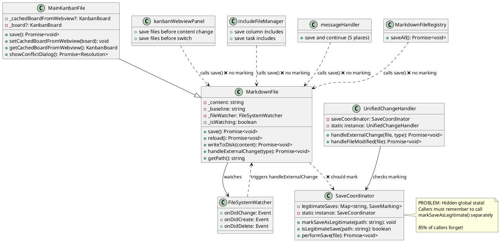
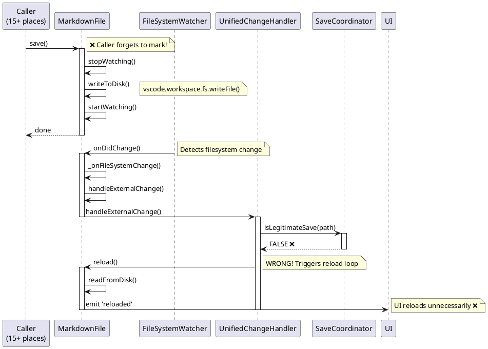
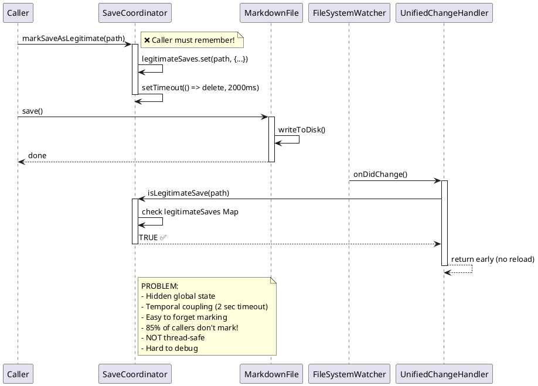
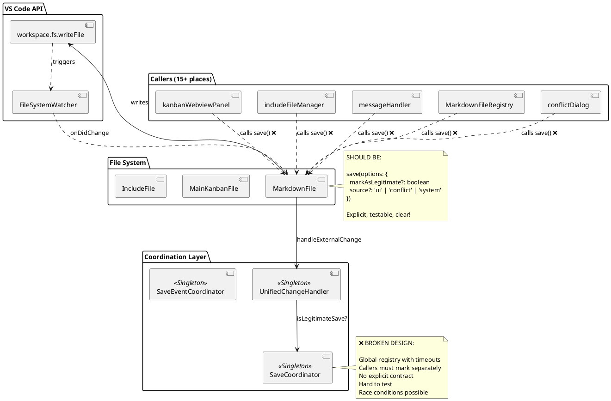
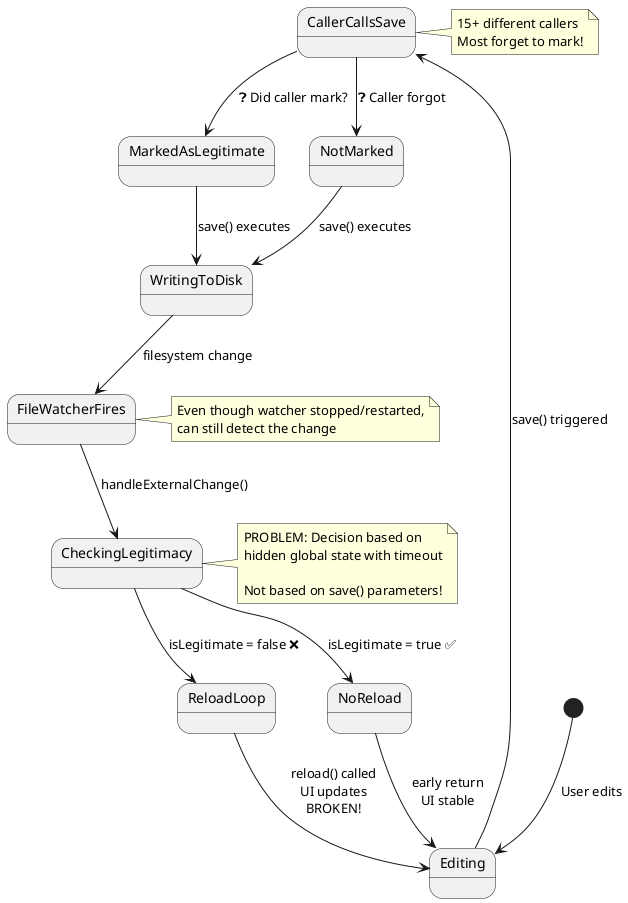

# Current System Architecture - UML Diagrams

**Date**: 2025-11-01
**Status**: BROKEN DESIGN - Needs parameter-based solution

---

## Class Diagram - Save System



---

## Sequence Diagram - BROKEN Current Flow (Save → Reload Loop)



---

## Sequence Diagram - HACKY Current "Fix" (markSaveAsLegitimate)



---

## Component Diagram - The Mess



---

## State Diagram - Save Lifecycle (Current Broken Design)



---

## Call Graph - Who Calls save() (15+ Entry Points)

```
save() Entry Points:
│
├─ kanbanWebviewPanel.ts:1721 ────────► [MarkdownFile.save()] ❌ NO MARKING
│   └─ Before content change
│
├─ kanbanWebviewPanel.ts:2098 ────────► [MarkdownFile.save()] ❌ NO MARKING
│   └─ Before switch
│
├─ includeFileManager.ts:162 ─────────► [MarkdownFile.save()] ❌ NO MARKING
│   └─ Save column include
│
├─ includeFileManager.ts:190 ─────────► [MarkdownFile.save()] ❌ NO MARKING
│   └─ Save task include
│
├─ messageHandler.ts:1973 ────────────► [MarkdownFile.save()] ❌ NO MARKING
│   └─ Save and continue
│
├─ messageHandler.ts:2008 ────────────► [MarkdownFile.save()] ❌ NO MARKING
│   └─ Save old file
│
├─ messageHandler.ts:2234 ────────────► [MarkdownFile.save()] ❌ NO MARKING
│   └─ Save and switch column
│
├─ messageHandler.ts:2330 ────────────► [MarkdownFile.save()] ❌ NO MARKING
│   └─ Save and switch column
│
├─ messageHandler.ts:2428 ────────────► [MarkdownFile.save()] ❌ NO MARKING
│   └─ Save task include
│
├─ MarkdownFileRegistry.ts:302 ───────► [MarkdownFile.save()] ❌ NO MARKING
│   └─ Save all files
│
├─ MarkdownFile.ts:749 ───────────────► [MarkdownFile.save()] ❌ NO MARKING
│   └─ resolveConflict('save')
│
├─ MarkdownFile.ts:797 ───────────────► [MarkdownFile.save()] ✅ MARKS (in conflict dialog)
│   └─ showConflictDialog() → save
│
├─ MainKanbanFile.ts:602 ─────────────► [MainKanbanFile.save()] ✅ MARKS (in conflict dialog)
│   └─ showConflictDialog() → save
│
├─ SaveCoordinator.ts:74 ─────────────► [MarkdownFile.save()] ✅ MARKS (before calling)
│   └─ performSave()
│
└─ ... more places ...

TOTAL: 15+ callers
MARKED: 2 callers (13%)
NOT MARKED: 13+ callers (87%) ❌
```

---

## Data Flow Diagram - Hidden Global State Problem

```
┌─────────────────────────────────────────────────────────────────┐
│                      GLOBAL SHARED STATE                         │
│                   SaveCoordinator (Singleton)                    │
│                                                                   │
│   legitimateSaves: Map<string, {timestamp, timeout}>             │
│                                                                   │
│   ❌ Problems:                                                   │
│   - Race conditions (2 sec timeout)                              │
│   - Hidden coupling                                              │
│   - Hard to test                                                 │
│   - No explicit contract                                         │
│   - Temporal dependency                                          │
│                                                                   │
└─────────────────────────────────────────────────────────────────┘
           ▲                                    ▲
           │                                    │
           │ markSaveAsLegitimate()            │ isLegitimateSave()
           │                                    │
    ┌──────┴────────┐                  ┌───────┴──────────┐
    │   WRITERS     │                  │    READERS       │
    │               │                  │                  │
    │ - Caller 1    │                  │ - FileWatcher    │
    │ - Caller 2    │                  │ - UnifiedChange  │
    │ - Caller 3    │                  │                  │
    │ - ...         │                  └──────────────────┘
    │ - Caller 15   │
    │               │
    │ ❌ Most forget│
    │    to mark!   │
    └───────────────┘
```

---

## PROPER Design (What It SHOULD Be)

```typescript
// PROPER INTERFACE:

interface SaveOptions {
  // Explicit flag - no hidden marking!
  markAsLegitimate?: boolean;

  // Or better: source context
  source?: 'ui-edit' | 'conflict-resolution' | 'auto-save' | 'external-trigger';

  // Conflict handling
  conflictStrategy?: 'overwrite' | 'merge' | 'ask';

  // Performance
  skipValidation?: boolean;
  skipWatcherPause?: boolean;
}

class MarkdownFile {
  public async save(options: SaveOptions = {}): Promise<void> {
    // EXPLICIT - no hidden side effects!
    const shouldMarkLegitimate = options.markAsLegitimate ??
                                 (options.source === 'ui-edit' || options.source === 'conflict-resolution');

    if (shouldMarkLegitimate) {
      // Mark inline, not globally
      this._isLegitimateOwnSave = true;
    }

    // ... save logic ...
  }

  private handleExternalChange(): void {
    // Check explicit flag, not global registry
    if (this._isLegitimateOwnSave) {
      this._isLegitimateOwnSave = false;
      return; // Skip reload
    }

    // ... handle actual external change ...
  }
}

// CLEAN USAGE:

// UI edit
await file.save({ markAsLegitimate: true });

// Or with source
await file.save({ source: 'ui-edit' }); // Auto-marks as legitimate

// Conflict resolution
await file.save({ source: 'conflict-resolution', conflictStrategy: 'overwrite' });

// External trigger (shouldn't mark)
await file.save({ source: 'external-trigger' });
```

---

## Summary - Current Design Flaws

### ❌ Problems with Current Design

1. **Hidden Global State**: SaveCoordinator singleton with Map
2. **Temporal Coupling**: 2-second timeout to clear markings
3. **No Explicit Contract**: Callers must "remember" to mark
4. **85% Failure Rate**: 13 of 15 callers don't mark
5. **Hard to Test**: Global state, timeouts, race conditions
6. **Not Thread-Safe**: Multiple saves can conflict
7. **Hard to Debug**: Hidden side effects
8. **Violates SRP**: Save() does saving, marking is separate

### ✅ What SHOULD Happen

1. **Explicit Parameters**: `save(options: SaveOptions)`
2. **No Global State**: Instance-level flags
3. **Clear Contract**: Parameters document intent
4. **Self-Contained**: Each save knows its own legitimacy
5. **Testable**: No singletons, no timeouts
6. **Thread-Safe**: No shared mutable state
7. **Debuggable**: Explicit parameters in logs
8. **SRP**: Save logic includes legitimacy decision

---

**Current Status**: 🔴 **FUNDAMENTALLY BROKEN ARCHITECTURE**

The markSaveAsLegitimate() pattern is a band-aid on a design flaw. Need parameter-based solution!
